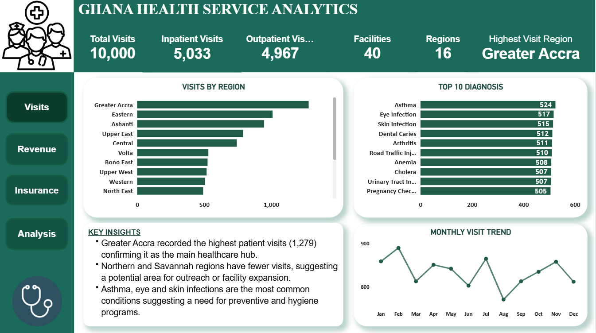
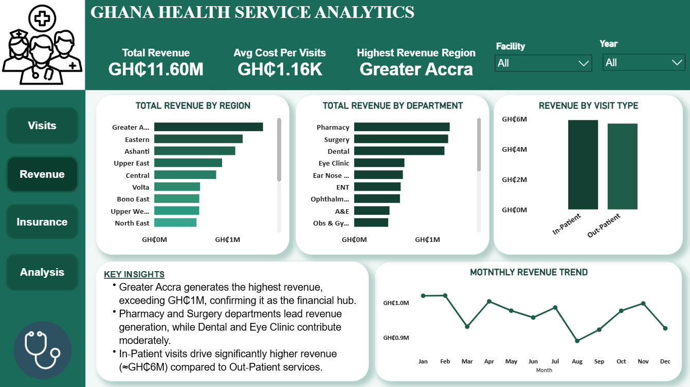
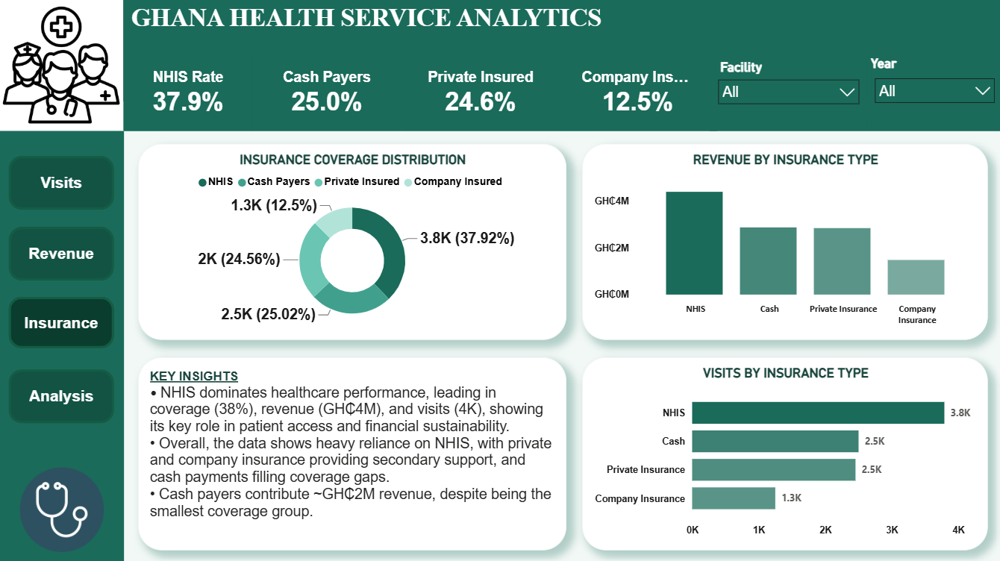
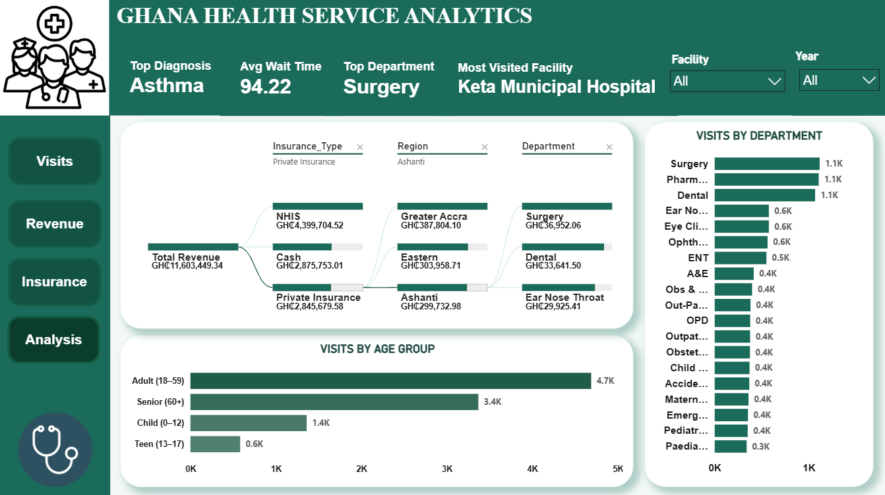

# 🏥 Ghana Health Service Analytics Report

An interactive Power BI report that analyzes healthcare operations across Ghana, providing insights into patient visits, revenue performance, insurance coverage, regional activity, and healthcare service utilization.

---

## 📌 Project Overview

The Ghana Health Service Analytics Dashboard was developed using **Power BI** to transform healthcare data into actionable insights for administrators and decision-makers.

The dashboard enables users to:

- Monitor healthcare facility performance
- Analyze patient visit trends
- Evaluate revenue generation across regions and departments
- Understand insurance coverage distribution
- Track diagnosis and departmental performance
- Support strategic healthcare planning through interactive analytics

---

## 📊 Report Pages

### 🩺 Visits Overview Dashboard

Provides an overview of healthcare utilization across facilities and regions.

**Highlights**

- Total Patient Visits
- Inpatient vs Outpatient Visits
- Visits by Region
- Top Diagnoses
- Monthly Visit Trend
- Regional Performance

---

### 💰 Revenue Dashboard

Analyzes revenue generation across healthcare services.

**Highlights**

- Total Revenue
- Average Cost per Visit
- Revenue by Region
- Revenue by Department
- Revenue by Visit Type
- Monthly Revenue Trend

---

### 🛡 Insurance Dashboard

Explores insurance coverage and its contribution to healthcare revenue.

**Highlights**

- Insurance Coverage Distribution
- Revenue by Insurance Type
- Visits by Insurance Type
- Insurance KPIs

---

### 📈 Healthcare Analysis Dashboard

Provides operational insights combining visits, departments, diagnoses and regional performance.

**Highlights**

- Most Visited Facility
- Top Diagnosis
- Average Wait Time
- Top Department
- Visits by Department
- Visits by Age Group
- Revenue Flow Analysis

---

## 📈 Key KPIs

- Total Visits
- Total Revenue
- Average Wait Time
- Average Cost per Visit
- Top Diagnosis
- Top Department
- Most Visited Facility
- Highest Revenue Region
- Insurance Coverage Rate

---

## ⚙️ Features

- Interactive slicers
- Dynamic filtering
- Drill-through navigation
- Cross-filtering
- DAX measures
- Power Query transformations
- Executive insights
- Responsive dashboard design

---

## 🛠 Tools & Technologies

- Microsoft Power BI
- Power Query
- DAX
- CSV Dataset

---

## 📂 Dataset

The project analyzes healthcare data including:

- Patient Visits
- Healthcare Facilities
- Departments
- Diagnoses
- Insurance Types
- Revenue
- Regions
- Waiting Times
- Visit Types

---

## 📸 Dashboard Preview

### Visits Overview Dashboard



---

### Revenue Dashboard



---

### Insurance Dashboard



---

### Healthcare Analysis Dashboard



---

## 📁 Repository Structure

```
ghana-health-service-analytics
│
├── README.md
├── PowerBI
│   └── Ghana Health Service Analytics.pbix
│
├── Dataset
│   └── healthcare_dataset.csv
│
└── Images
    ├── homepage.png
    ├── visits-dashboard.png
    ├── revenue-dashboard.png
    ├── insurance-dashboard.png
    └── analysis-dashboard.png
```

---

## 📌 Key Insights

- Greater Accra consistently records the highest patient visits and revenue, highlighting its role as the country's primary healthcare hub.
- NHIS is the dominant insurance provider, contributing the largest share of healthcare coverage, visits, and revenue.
- Surgery and Pharmacy departments generate the highest patient activity and revenue across facilities.
- Adult patients (18–59 years) account for the largest proportion of healthcare visits.
- Asthma, eye infections, and skin infections are among the most common diagnoses, indicating priority areas for public health interventions.

---

## 🚀 Future Improvements

- Real-time hospital reporting
- Predictive patient demand forecasting
- Geographic mapping of healthcare facilities
- Bed occupancy analytics
- Doctor workload analysis
- Patient satisfaction dashboard

---

## 👤 Author

**Rachel Konadu Gyamfi**

Power BI • Data Analytics
